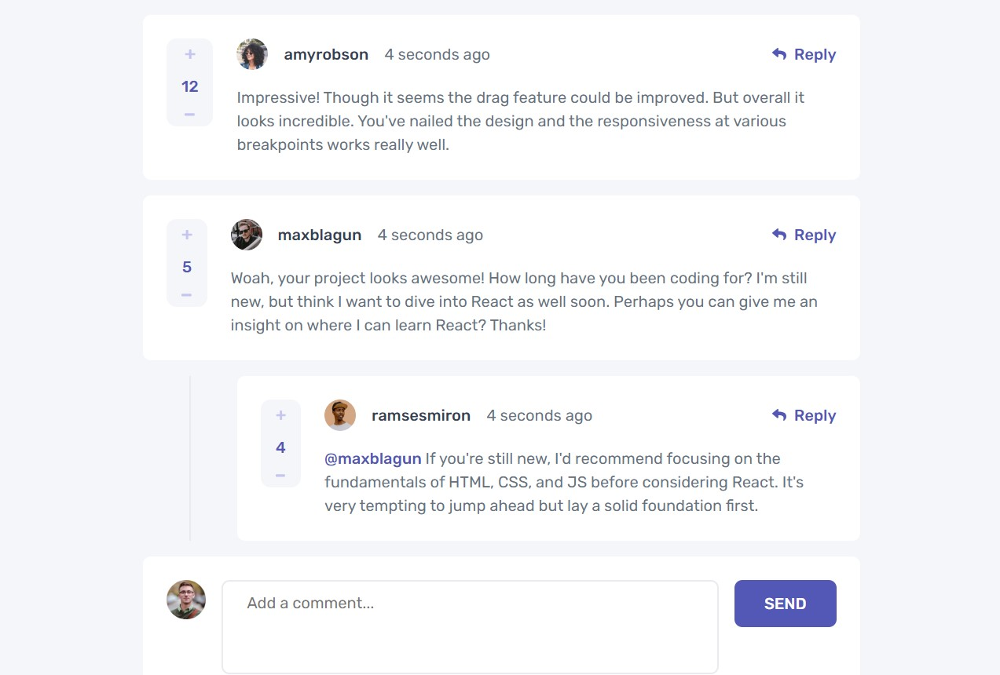

# Frontend Mentor - Interactive comments section solution

This is a solution to the [Interactive comments section challenge on Frontend Mentor](https://www.frontendmentor.io/challenges/interactive-comments-section-iG1RugEG9).

## Table of contents

- [Overview](#overview)
  - [The challenge](#the-challenge)
  - [Screenshot](#screenshot)
  - [Links](#links)
- [My process](#my-process)
  - [Built with](#built-with)
  - [What I learned](#what-i-learned)
  - [Continued development](#continued-development)
- [Author](#author)

## Overview

### The challenge

- View the optimal layout for the app depending on their device's screen size
- See hover states for all interactive elements on the page
- Create, Read, Update, and Delete comments and replies
- Upvote and downvote comments
- Persistence of data with localstorage
- Track the time in which a comment was posted.

### Screenshot

### Links

- Solution URL: [Add solution URL here](https://your-solution-url.com)
- Live Site URL: [Add live site URL here](https://your-live-site-url.com)

## My process

### Built with

- Angular
- CSS
- Flexbox & Grid
- Semantic HTML

### What I learned

- Components
- Built-in Directives & Custom Directives
- Dependency injection and services
- Inputs and outputs
- Component lifecycle
- Other decorators

### Continued development

I would like to continue to get better at CSS and creating more independent and reusable components, as well as delve into Angular deeper.

## Author

- Website - [Alexander Guillén Hernández](https://alexanderguillen.netlify.app/)
- Frontend Mentor - [@AlexanderTheWise](https://www.frontendmentor.io/profile/yourusername)
